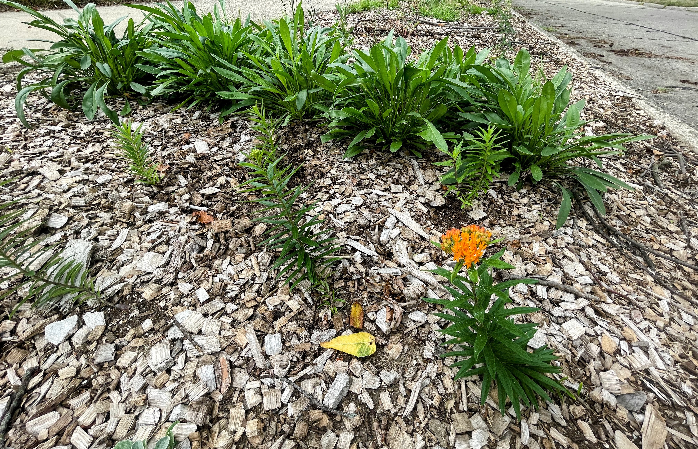
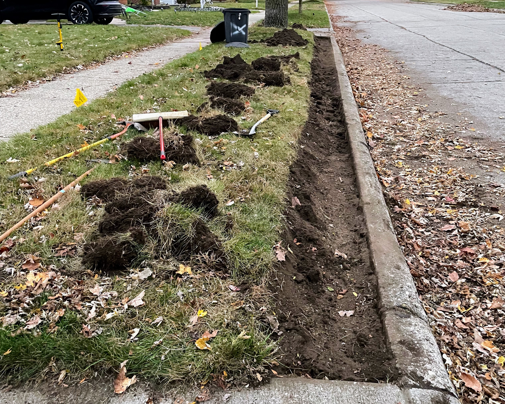
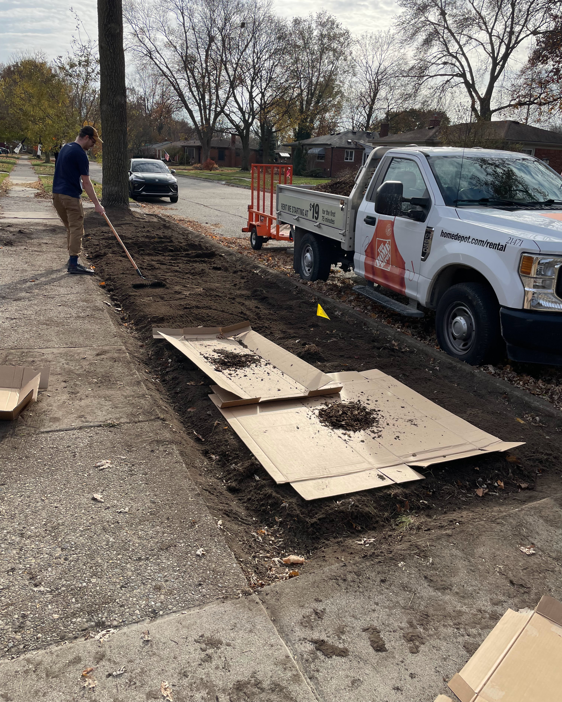
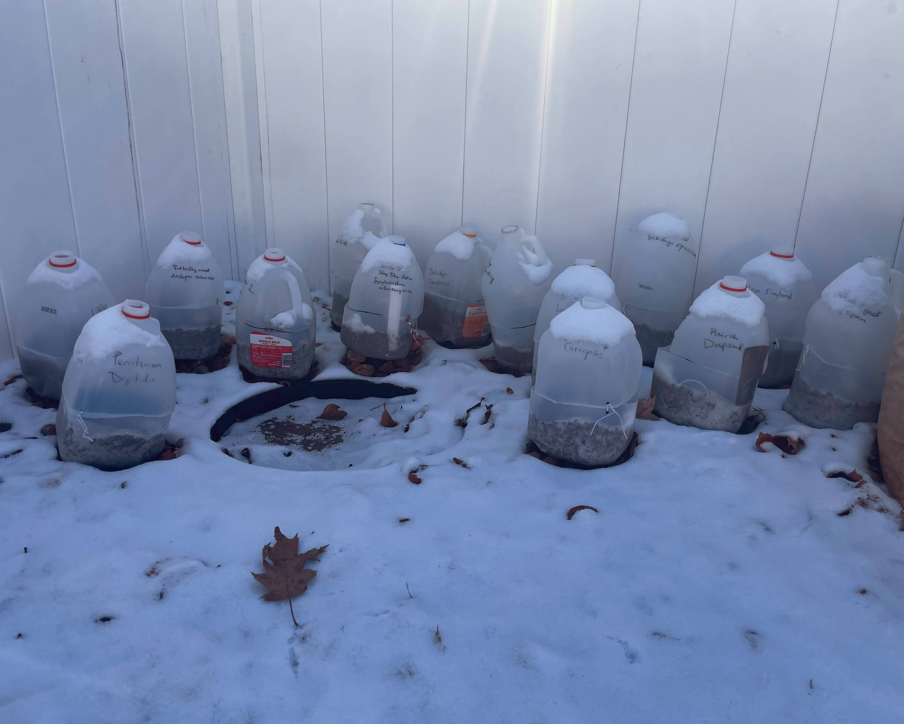
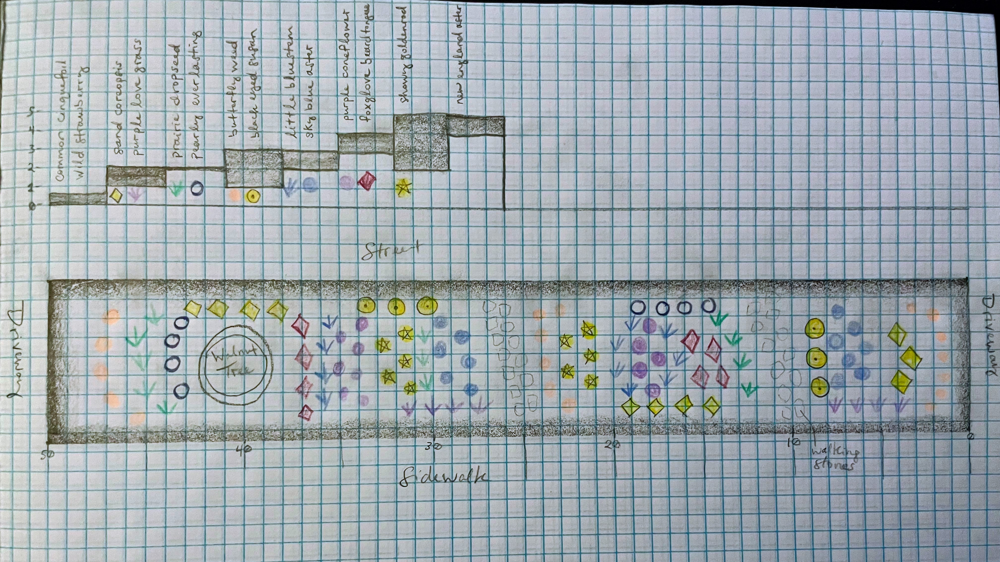
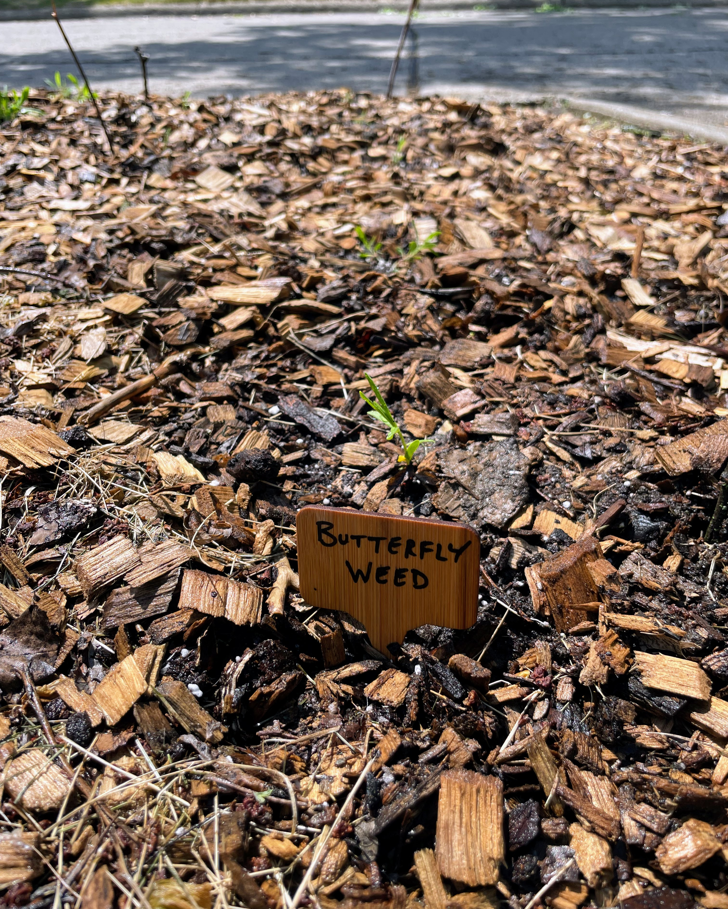
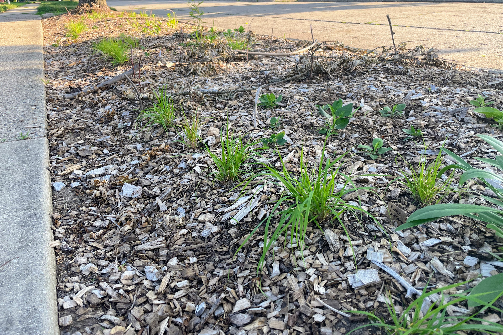

Hi, we're David and Kelly!
If you're here, you've probably walked by our house and noticed the garden in our front yard.
Maybe you've wondered:
what are you growing, why are you growing it, and why are you growing it _there_?
We'd love to tell you all about it! So we made this webpage to do just that.
And maybe by the end of it, you might even wonder:
_how can I start a garden like yours in my own yard?_

You can read [our garden's story below](#our-gardens-story),
dive in to learn about [what's growing in the garden](plants.qmd),
or check out [links to resources](resources.qmd) that have helped us in our journey!

{width="100%"}

## Our garden's story

We moved into the neighborhood in fall of 2024 -- our first home!
We spent most of 2025 dreaming of planting native plants in our yard, but unsure
how to bring this dream to reality.
We decided to turn the entire section of lawn between the sidewalk and street
into a pollinator-friendly native garden.
Kelly especially has dreamt of cultivating her own garden filled with native
plants to support birds, bees, butterflies, and other creatures that are vital
to our local ecosystem.
Our hope is that by having the garden in the front yard, neighbors and passersby
will get to enjoy it as well.
In the fall of 2025, we fully committed to our plan: we rented a sod cutter and
removed the grass in the entire 425 square foot area between the sidewalk and
street.
The dirt level was higher than the sidewalk, so we also removed and re-leveled a
lot of dirt, and dug a shallow trench alongside the sidewalk so that in the
future any mulch that may escape the garden can easily be swept back in.
We laid down cardboard, newspaper, leaves, and a thick layer of wood chips
sourced from a neighbor's Chip Drop pile.

:::{layout="[1.5,1]"}

:::

Over the winter, I (Kelly) attended
[Wild Ones Wayne County](https://waynecountymichigan.wildones.org)
workshops on seed cleaning and
[winter sowing](https://growitbuildit.com/illustrated-guide-to-winter-sowing-with-pictures/),
and took seeds home with me.
My neighbor and I sowed seeds in milk jugs and placed them outside in January
and February to face the Michigan winter weather.
I sketched out a rough planting plan following guidelines such as repeated
drifts of 3-5 plants, dense planting with approximately 12 inch spacing between
plants, keeping taller plants toward the center and short plants closer to the
sidewalk.
I want the garden to look thoughtfully designed and somewhat tidy so that
neighbors will have a positive impression of native gardening practices.

:::{layout="[1,1.4]"}

:::

By mid April 2026, everything in the milk jugs had sprouted. In mid May, many of
the seedlings were gaining their true leaves, and I opened up the milk jugs to
avoid overheating.
Unfortunately, we lost one jug of little bluestem to chipmunks, but everything
else did extremely well with the winter sowing method.
I started transplanting seedlings directly to the garden in late May.
I laid down sticks to mark designated walking paths, and plan to add stepping
stones in the future.
By mid June, I had finished transplanting most of the seedlings and it started
to look like an actual garden!
We added small signs to label the plant species for curious passersby, and to
help us identify what we planted next spring.

:::{layout="[1,1.9]"}

:::

Our garden is still in its infancy, and there is more work to do such as filling
in more grasses between forbs and adding ground cover like wild strawberry.
But the potential for beautiful blooms and all the wild critters they will
attract fills us with hopeful expectation for the future as we watch our garden
mature over the years.
We decided to call this section between the sidewalk and street "The Gateway Garden";
it's our first big step through the doorway of native gardening, and we hope it
can become a gateway for others too!

You can learn more about what's growing in the Gateway Garden [here](plants.qmd).

:::{.flex-container .align-center style="margin-left: 75px; margin-right: 75px"}

:::