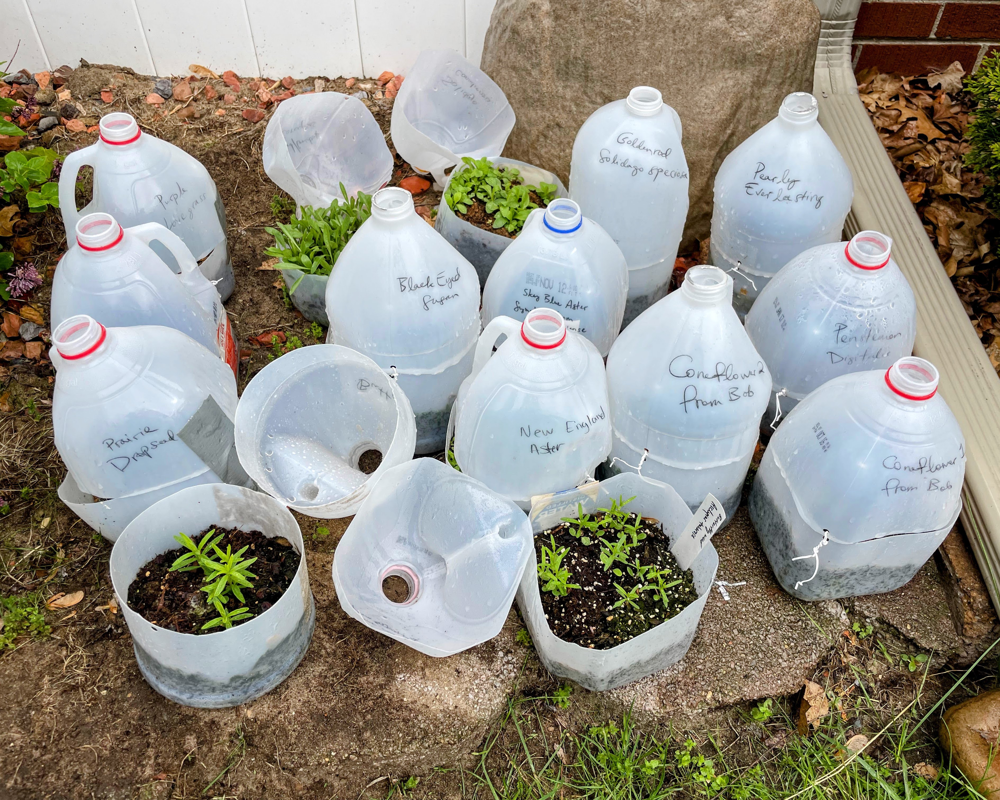
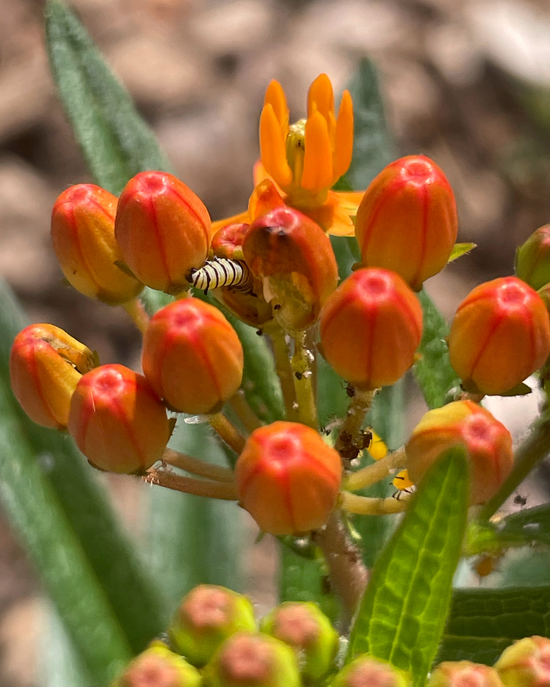

- [Wild Ones - Wayne County Michigan Chapter](https://waynecountymichigan.wildones.org/)
  - [Guide to creating a garden plan](https://nativegardendesigns.wildones.org/create-your-garden-plan/)
- [Guide to winter sowing - Grow It Build It](https://growitbuildit.com/illustrated-guide-to-winter-sowing-with-pictures/)
- [National Wildlife Federation](https://nwf.org/)
- [Michiganse Natives Growing Guide](https://www.michiganensenatives.com/growing)
- [MSU Native Plant selection](https://www.canr.msu.edu/nativeplants/plant_facts/)

&nbsp;

:::{layout=[1.57,1]}

:::